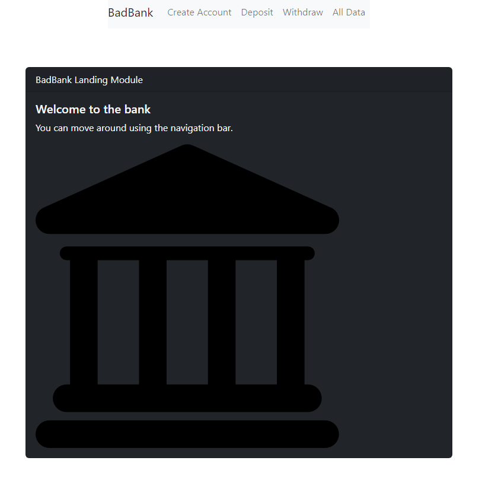

# BadBank



## Description

    This project is from Professional Certificate in Coding: Full Stack Development with MERN, from MIT.

    The objective is to make a three tier application:
    1. React App for front end
    2. Node/Express App for backend
    3. MongoDb as Database
    4. Google Firebase for Authentication

## Installation

    Clone the repository and start terminal for server application and run:

```
  npm start
```

    Then cd into client folder and start second terminat and run:

```
  npm start
```

    Now navegate to localhost:3000 to use the app.

## Features

    1. Authentication
    2. Deposits
    3. Withdraws
    4. Transaction history

## Roadmap of future improvements

    1. Roles for visitors, customers and administrators
    2. Improved front end design
    3. SEO optimizations

## LICENCE

MIT
